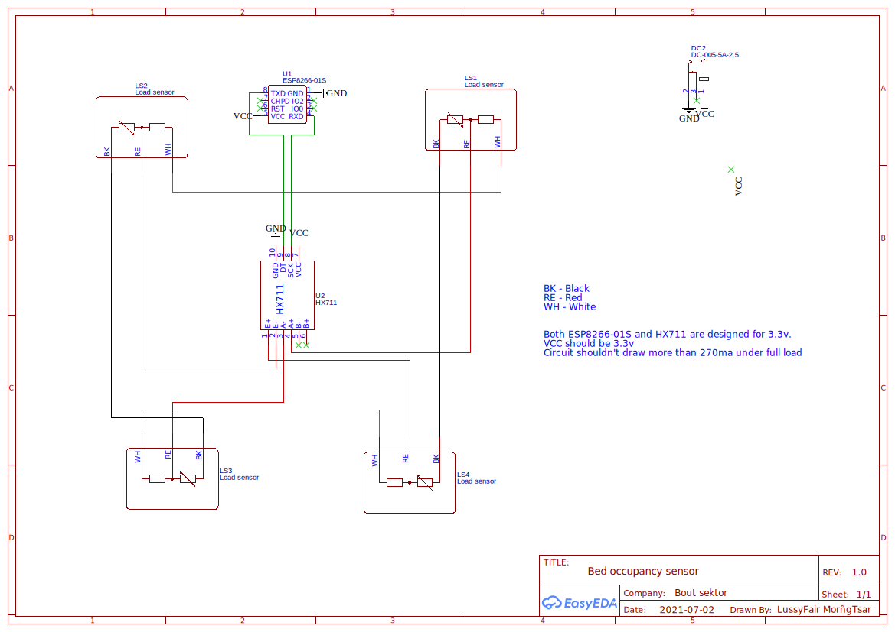
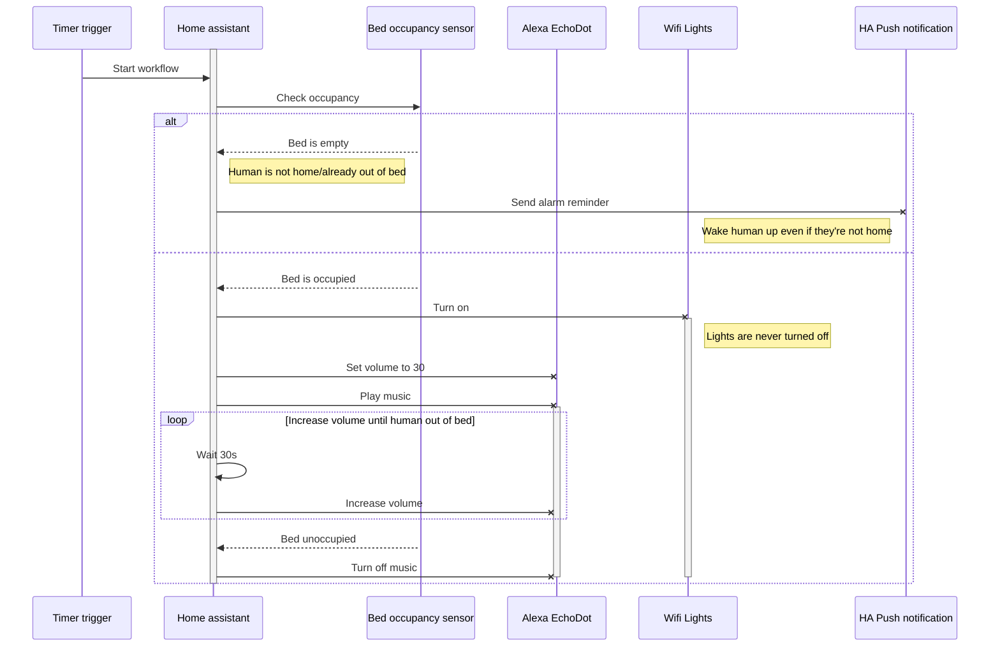
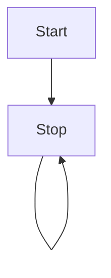

##  True purpose of an alarm clock

More often than not, when you set an alarm to ring in the morning, the intention is to get out of bed at the time of ringing. It seems my brain didn't get the memo and just has me go back to sleep at the very moment I hit the "shut up I'm trying to sleep" button. For this reason, I've decided to make it so my alarm would only stop ringing if I physically get out of bed and ring again if I get back in bed. 

## Hardware/Software
- 4 Load cells ['4x quarter bridge cells' @Amazon](https://www.amazon.co.uk/gp/product/B07TWLP3X8/ref=ppx_yo_dt_b_search_asin_title?ie=UTF8&psc=1)
- Analog to digital convert ['HX711 ADC' @Amazon](https://www.amazon.co.uk/gp/product/B07QGQ79VW/ref=ppx_yo_dt_b_search_asin_title?ie=UTF8&psc=1) (A cheap one is already included in the above link)
- Wifi RX/TX module ['ESP8266-01s' @Amazon](https://www.amazon.co.uk/gp/product/B0728CBGKT/ref=ppx_yo_dt_b_search_asin_title?ie=UTF8&psc=1)
  - ESP8266-01s Breakout adapter [@Amazon](https://www.amazon.co.uk/MakerHawk-nRF24L01-ESP8266-Breadboard-Breakout/dp/B072FLGDXQ/ref=pd_bxgy_img_1/261-8943169-1506030?pd_rd_w=ao76F&pf_rd_p=c7ea61ca-7168-47e3-9c8b-d84748f5b23c&pf_rd_r=7SBPT52PQW66W9PKQGP8&pd_rd_r=17c477db-3110-41f9-bbde-3efa6bf41e2c&pd_rd_wg=JcJLr&pd_rd_i=B072FLGDXQ&psc=1) (not mandatory but recommended)
  - A addapter board to program the ESP8266. The one I bought has been discontinued but something like this [@Amazon](https://www.amazon.co.uk/ESP-01-Adapter-ESP8266-Wireless-4-5-5-5V/dp/B07Q17XJ36/ref=pd_bxgy_img_2/261-8943169-1506030?pd_rd_w=ao76F&pf_rd_p=c7ea61ca-7168-47e3-9c8b-d84748f5b23c&pf_rd_r=7SBPT52PQW66W9PKQGP8&pd_rd_r=17c477db-3110-41f9-bbde-3efa6bf41e2c&pd_rd_wg=JcJLr&pd_rd_i=B07Q17XJ36&psc=1) should work nicely.  
- DC Barel Jack ['DC-005-5A-2.5' @LCSC]()
- Protoyping board [@Amazon](https://www.amazon.co.uk/gp/product/B08151V9TS/ref=ppx_yo_dt_b_search_asin_title?ie=UTF8&psc=1) (not mandatory but it makes the wiring much cleaner)

## Software pre-requisites
Home assistant, ESPHome, Node RED

## Wiring board

Top & Bottom whites go together. Left and right blacks go together. Reds go to HX711



## ESPHome node YAML configuration & uploading

 Official [ESPHome wifi configuration](https://esphome.io/components/wifi.html)

Official [ESPHome HX711 configuration](https://esphome.io/components/sensor/hx711.html)

```yaml
esphome:
  name: bed_occupancy
  platform: ESP8266
  board: esp01_1m

wifi:
  ssid: "__REDACTED__"
  password: "__REDACTED__"
  ap:
    ssid: "Bed Occupancy Fallback Hotspot"
    password: "__REDACTED__"

sensor:
  - platform: hx711
    name: "HX711 Value"
    dout_pin: TX #Data
    clk_pin: RX #Clock
    gain: 128
    update_interval: 1s
```
The `wifi` and `wifi.ap` are pretty standard. If you don't know how it works, checkout the well made [wifi getting started guide](https://esphome.io/components/wifi.html) over at ESPHome.com

The above configuration will set `RX` as the clock pin, `TX` as the data pin and poll for a new value once every second. You can change the `update_interval` to suit your need. If you are using a model of ESP that isn't the ESP8266-01s you MAY need to change the `TX` and `RX` values.

## Logic & automation

### C# platform

My automations are written in c# using the [HomeAssistantNet](https://github.com/anhaehne/hhnl.HomeAssistantNet) HASSIO plugin. If you have never used this plugin, checkout [the wiki](https://github.com/anhaehne/hhnl.HomeAssistantNet/wiki). It is very well written. I chose to use C# because it is a language I am very familiar with, but all this should be possible to do using the normal script or the NodeRED plugin if you prefer.

#### Note on HomeAssistantNet

Be aware that HomeAssistantNet relies on .NET 6 which is, at the time of writing (2021-07-19), in it preview version. It is not technically intended to be used for production development. I have not encountered any problem but it is still something to be aware of. You should also know that using .NET 6 currently requires that you use Visual Studio 2022, with preview version v17 or higher. 

### Schematics



## C# Code

The full c# code can be found in the [BootSektor bed alarm repository]().

Here is a simplified version containing only the critical parts

```csharp
[Automation]
public async Task BedAutomation(HomeAssistant.Sensors.BedSensorCorrectedValue bed)
{
    if (bed == null) throw new ArgumentNullException(nameof(bed));

    if (int.Parse(bed.State) >= 5)
        await TurnLightsOff();
    if (int.Parse(bed.State) < 5)
        await TurnLightsOn();

    await setVolume(.35);
    TextToSpeech().Wait();
    await StartPlayingMusic();

    while(isInBed())
    {
        Thread.Sleep(30 * 1000);
        await IncreaseVolumeBy(.5);
    }

    await StopPlayingMusic();
}

```




As per my post about [naming conventions & self-commenting code](https://danger-zone.viales.fr/Post/3/naming-matters), the above code should be easy enough to understand without any additional explanation. If you want to copy&paste the same code I use, you can find the complete source on the  [BootSektor bed alarm repository]().

## Mounting in frame & installation under bed

## Configuration of alarm clock & lights

## Other opportunities & future developements

### Dynamic wakeup time
Replace the hard-coded wakeup time with a dynamic API call to a calendar/microsoft teams for example. This would allow the alarm to be triggered at different times depending on the next day's schedule =
### Sleep cycles/quality analysis & sync wakeup
Using this system, it would be possible to analyse sleep patterns to determine the sleep stage & trigger the alarm at the best time for a seemless wakeup